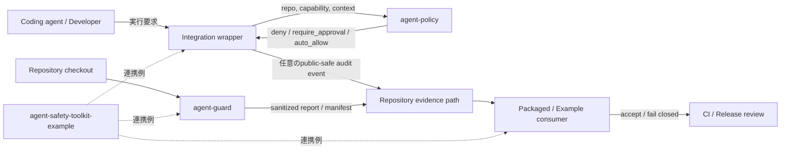
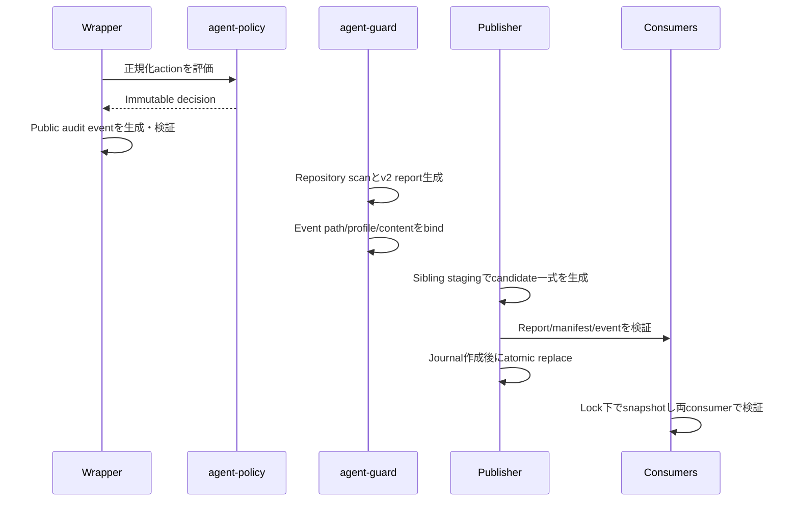

# agent-guard エコシステム設計書

## 1. 文書管理

| 項目 | 内容 |
| --- | --- |
| 文書種別 | システム設計、セキュリティ設計、連携設計、運用設計 |
| 状態 | 現行設計ベースライン |
| 基準日 | 2026-08-30 JST |
| 文書ID | `AG-ECO-DESIGN-001` |
| 規範版 | `1.2` |
| Canonical保管場所 | `agent-guard/docs/architecture/agent-guard-ecosystem-design.md` |
| Document custodian | `agent-guard` repository maintainer。保管・同期責任であり、他repositoryの運用権限ではない |
| Requirement owner / Approver | 各要件を実装するrepositoryのmaintainer。Cross-repository contract変更は全affected repositoryのreviewが必要 |
| Supersedes | 2026-08-29に作成したunversioned review copy |
| 主対象 | `agent-guard` |
| 関連対象 | `agent-policy`、`agent-safety-toolkit-example` |
| 想定読者 | メンテナー、レビュアー、CI導入担当者、evidence consumer実装者 |

### 1.1 基準バージョン

| Repository | Protected default branch基準 | Review candidate実装基準 | 公開基準 | 役割 |
| --- | --- | --- | --- | --- |
| [`agent-guard`](https://github.com/yui-stingray/agent-guard) | `5960ba97032399f27cef1f49c96dbcd3477ad97d` | `9392efce0a5f0fa2133ace2100d6cf57308bdcdb` | `v0.3.9`、release commit `9c4680f0a2da01505bb12782b8b720c29e3dee43` | 決定論的な静的evidence gate |
| [`agent-policy`](https://github.com/yui-stingray/agent-policy) | `002570ea8c2a36189c56e186ec2e60e1e49cb85a` | `080faca4343f3671c52c2b21d6090f5c1bd8a78c` | `v0.1.18` | 任意導入の実行時admission evaluator |
| [`agent-safety-toolkit-example`](https://github.com/yui-stingray/agent-safety-toolkit-example) | `15e44eef41e639190e340b4ffa67a278ba19874b` | `8ea48dc9926c55ac70af7a623c3ebcd8b35178c9` | Package releaseなし | public-safeな参照統合 |

この設計変更branchでは、公開版とsource artifactを区別するため`agent-guard`を
`0.3.10.dev0`、`agent-policy`を`0.1.19.dev0`とする。公開install、provenance、Toolkit
pinは引き続き`0.3.9` / `0.1.18`であり、未公開版へ先行更新しない。

### 1.2 規範性

`MUST`、`MUST NOT`、`SHOULD`、`MAY`を含む要件ID付き記述と、明示的に
「規範」と表示した表を規範とする。図、背景、例、理由、現状説明、参考commandは
informativeであり、それ自体は新しい保証を作らない。実装、schema、test、CI、live
rulesetが規範記述と矛盾する場合は、より安全な側へfail closedにしたうえで文書または
実装を同じchange setで修正する。

Canonical保管場所はcoordination baselineの所在だけを定める。各repositoryは、その
implementation、ruleset、release、incident actionの唯一の運用ownerであり、本書または
`agent-guard` maintainerが他repositoryのcontrolを直接変更する権限を持つことを意味しない。
他repositoryに作用する要件は、affected repository自身のreviewed changeとlocal CI/controlへ
反映された時点でのみ有効になる。

### 1.3 改訂履歴

| 規範版 | 日付 | 変更 | 承認証跡 |
| --- | --- | --- | --- |
| `1.0` | 2026-08-29 | 初版review copy | 作成task |
| `1.1` | 2026-08-29 | 規範区分、要件ID、publication state machine、wrapper binding、freshness、compatibility gate、governanceを追加 | 本文書を変更するPR |
| `1.2` | 2026-08-30 | Repository-local authority、review済みcandidate gate、traceabilityとlive ruleset確認を同期 | 3 repositoryのreview PR |

## 2. 目的

本エコシステムは、AI coding agentを利用するrepositoryについて、次の
2つの問いに再現可能な根拠を与える。

1. Agent向けファイル、policy、workflow、evidence artifactが、レビュー済みの
   静的ルールを現在も満たしているか。
2. 実行時admissionを導入する場合、正規化されたagent actionを`deny`、
   `require_approval`、`auto_allow`のどれに判定すべきか。

1は`agent-guard`、2は任意のcompanionである`agent-policy`の責務とする。
Toolkit repositoryは、両者のpublic-safeな連携例を示す。

設計上は、LLMによる判断ではなく、決定論的コード、versioned contract、
入力の上限制御、fail-closedな失敗処理を優先する。

## 3. 設計判断

以下を本ベースラインの規範的な設計判断とする。

1. `agent-guard`を単独導入可能な主プロダクトとする。
2. `agent-policy`は静的scannerへ統合せず、任意の実行時companionとして分離する。
3. Toolkitは参照実装であり、第3のframeworkや必須dependencyにはしない。
4. Repository内ファイル、policy、workflow本文、外部評価、MCP metadata、
   生成レビューはすべてuntrusted dataとして扱う。
5. Public evidenceには制御済みmetadataとsanitized findingのみを含める。
6. 不明、曖昧、過大、不整合、未対応のsecurity-sensitive inputはfail closedにする。
7. 静的evidenceを、実行時安全性、人間の承認、脆弱性不在、compliance、
   provenanceの証明として扱わない。
8. 実装言語はPythonを継続する。現時点の性能、移植性、需要の根拠では、
   Rust、Go、TypeScriptへのrewriteを正当化できない。
9. 新機能は需要検証に連動させる。再現可能なsecurity fixとcompatibility fixを
   優先する。
10. Marketplace公開、runtime MCP validator、live OAuth validator、generic secret
    scanner、LLM reviewerは別プロダクト判断とする。

**規範要件**

- `AG-ECO-REQ-001`: 3 repositoryは5.1の責務境界をMUST維持する。
- `AG-ECO-REQ-002`: Untrusted inputは命令として実行せず、対応するbounded
  parser/reader/classifierを通過しない限りsecurity decisionへ使用してはならない。
- `AG-ECO-REQ-003`: Public evidenceをruntime safety、approval、whole-tree identity、
  provenance、complianceの証明として表現してはならない。

## 4. スコープ

### 4.1 対象範囲

- 永続的なagent-facing repository surfaceの静的inventory。
- Repository-localなreviewed policyに対する決定論的check。
- Sanitized JSON、Markdown、GitHub annotation、SARIFの生成。
- Report、manifest、inventory、conformance、consumerのversioned contract。
- Public-safeな`agent-policy` audit eventのpath、profile、content binding。
- Reportおよびevidence bundleのfail-closedなdownstream consumption。
- 正規化済みcapabilityに対する任意のpure-function admission decision。
- Exact-hash install、admission、evidence生成、検証、crash-consistent publicationの
  公開demo。
- CI、release provenance、package contract、branch protection。

### 4.2 対象外

- Runtime agent sandbox、process isolation。
- MCP server実行、tool result inspection、runtime tool-poisoning detection。
- Runtime prompt injection、memory poisoningの検出。
- Live OAuth、token audience、consent、session、elicitationの検証。
- Generic credential、secret、malware、PII scan。
- Authorship detection、model quality scoring。
- LLMによる承認、issue triage、自律的policy変更。
- SLSA level、security、compliance certificationの主張。
- Runner、Python、Git、dependency、OSが侵害されていないことの証明。

## 5. システムコンテキスト



### 5.1 責務分担

| Layer | 所有する責務 | 所有しない責務 |
| --- | --- | --- |
| Integration wrapper | Tool payloadの正規化、action vocabulary、信頼済みruntime state、decision enforcement | 静的repository evidence contract |
| `agent-policy` | `(policy, repo, capability, context)`のpure evaluation | Shell実行、I/O、log、transport、approval UI |
| `agent-guard` | 静的inspection、sanitized evidence、schema validation、evidence consumption | Runtime security、approval decision |
| Toolkit | 連携およびpublication protocolの実例 | Generic product API、広範なplatform guarantee |
| Maintainer | Policy、exception、merge、releaseの最終判断 | Reportへの説明責任の委譲 |

## 6. Repository構成

### 6.1 agent-guard

`agent-guard`は次の論理layerで構成する。

1. **CLI / command orchestration**
   - Scanner commandと、`report`、`render-report`、`surface inventory`、
     `surface delta`、`drift`、`conformance`、`evidence-pack manifest`。
2. **7つのprimary scanner**
   - `api`、`content`、`context`、`mcp`、`path`、`digest`、`workflow`。
3. **Bounded input / execution primitive**
   - Descriptor-bound read、size/count/depth budget、strict YAML/JSON、
     isolated regex scan、bounded Git、output cap、deadline、sanitized error。
4. **Evidence construction / rendering**
   - Public-safe report、coverage、inventory、conformance、Markdown、
     annotation、SARIF。
5. **Evidence consumer**
   - Schema、section、count、status、redaction、path、profile、content bindingの検証。
6. **Packaged GitHub Action**
   - Python runtimeを自身で準備するLinux専用Composite Action。

### 6.2 agent-policy

`agent-policy`は意図的に小さく保つ。

- `matrix`: typed policy modelとoverlap validation。
- `guardrails`: private immutable evaluation stateと互換用inspection copy。
- `evaluator`: pure decision evaluation。
- `decision`: immutable decision value object。
- `audit`: deterministicかつimmutableなaudit event生成。
- `loader`: strict TOML policy loading。
- `schemas`: v1 / v1.1 audit-event JSON Schema。
- `examples`: bounded wrapperとhook例。Pure evaluatorのtrust boundary外である。

### 6.3 agent-safety-toolkit-example

Toolkitは次をまとめた参照repositoryである。

- Repository-localな`agent-guard` / `agent-policy` policy。
- 固定されたaction-to-capability vocabulary。
- Public-safe audit event producer / validator。
- 1つのdocumented platform向けexact-hash dependency lock。
- End-to-end demoとexternal timeout wrapper。
- Packaged consumerとexample consumer。
- Staging、lock、journalを使うevidence publisher。
- 再現可能なcommitted v2 evidence sample。
- 全連携を検証する1つのGitHub Actions workflow。

## 7. agent-guard静的evidence設計

### 7.1 入力

Commandに応じて次を検査する。

- `AGENTS.md`、`CLAUDE.md`、対応editor形式等のagent context file。
- `.agent-guard`配下のpolicy。
- GitHub Actions等のworkflow metadata。
- Committed MCP configuration metadata。
- Repository-relative pathと選択されたtext file。
- Git index、tree、bounded diff metadata。
- 既存evidence reportと任意のpublic-safe policy audit event。

入力は命令ではなくdataである。Instructionに見える文字列も、documented policy fieldを
通じて明示的に採用されない限りscannerの動作を変更できない。

### 7.2 Scanner契約

| Scanner | 判定する静的な問い | 主なfail-closed境界 |
| --- | --- | --- |
| `api` | Endpoint referenceがallow/deny policyを満たすか | Bounded file/pattern、HTTP/HTTPS両方の評価 |
| `content` | 選択textに禁止instruction patternがあるか | Isolated regex、自己承認inline suppressionの禁止 |
| `context` | Agent instructionがreview済み境界を維持するか | Bounded inventory/matching、sanitized timeout |
| `mcp` | Committed MCP metadataに静的risk labelがあるか | 実行禁止、strict budget、package pin semantics |
| `path` | Path名がprivate/leak-prone artifactを示すか | Bound traversal、aggregate result limit |
| `digest` | Review済みfileがSHA-256 pinと一致するか | Strict policy parse、descriptor-bound read |
| `workflow` | Required guard commandとpolicy referenceが維持されるか | Dedicated step、option override拒否、strict YAML |

`surface inventory`、`surface delta`、`drift`、`report`は上記primitiveを
合成するが、trust boundaryは拡張しない。

### 7.3 Workflow required-command

Required commandとして認める条件は次のとおり。

- Supported shellのdedicated stepに1つのdirect commandだけがある。
- Same-step setup、control flow、dynamic redirection、unsupported shell構造がない。
- Workflow/job/stepにcommand resolutionを変えるenvironment、container、
  working-directory設定がない。
- Required optionがprefix一致ではなく意味的に同一であり、重複optionによる
  last-wins overrideがない。
- Python module formは`python -I -m agent_guard.cli`を使用し、checkout内の
  同名packageによるshadow importを防ぐ。
- Documented limit内のconsole script formは互換性を維持する。

これはworkflowの静的shapeを証明するだけである。Hostが選択するruntime executableや
前stepから残るrunner stateはattestしない。

## 8. Evidence contract

### 8.1 Public artifact

| Artifact | Schema | 用途 |
| --- | --- | --- |
| Result envelope | `agent-guard.result.v1` | 共通scanner/result wrapper |
| Context inventory | `agent-guard.context_inventory.v1` | Redacted context metadata |
| Context lock coverage | `agent-guard.context_lock_coverage.v1` | Hash-free digest coverage |
| Eventなしreport | `agent-guard.report_evidence.v1` | Sanitized static evidence |
| Bound event付きreport | `agent-guard.report_evidence.v2` | Static evidenceとevent binding |
| Conformance | `agent-guard.conformance.v1` | `minimal` / `recommended` / `strict` profile |
| Event-free / legacy manifest | `agent-guard.evidence_pack_manifest.v1` | Unbound artifact index |
| Bound manifest | `agent-guard.evidence_pack_manifest.v2` | Content-bound artifact index |
| Surface delta | `agent-guard.surface_delta.v1` | Sanitized base/head surface change |

### 8.2 Compatibility

- Event-free reportはv1を維持する。
- Recognized audit eventを指定した場合だけreport/manifest v2を生成する。
- Compatibleな`0.x` releaseでは既存v1 consumerを維持する。
- Incompatibleな変更には新しいschema identifierを付与する。
- Fixed public bundleへartifact名を追加する場合はbundle version更新または
  explicit opt-inを必要とする。

### 8.3 Audit-event binding

認識するpublic profileは次の1つである。

```text
agent-guard.public_agent_policy_audit_event.v1
```

Producerとconsumerは各eventについて次を検証する。

1. Canonicalでsanitizedなrepository-relative path。
2. 明示されたrecognized profile。
3. Guard-owned public-safe semantic subsetへの適合。
4. Canonical JSON serialization。
5. Domain-separated SHA-256 digestのcontrolled public encoding。
6. 入力event pathとmanifest artifact pathの完全一致。
7. Consumer実行時のprofileとcontentの完全一致。

`AG-GUARD-REQ-001`として、`canonical-json-v1`は次のbyte algorithmをMUST
使用する。

1. Inputは最大`MAX_AGENT_POLICY_AUDIT_EVENT_BYTES` bytesのUTF-8 JSON objectとする。
2. Duplicate memberと`NaN`、`Infinity`、`-Infinity`をrejectする。
3. Integer/floatはbinary numberへ変換せず、JSON parserが検証した元のnumber lexemeを
   保持する。このため`1`、`1.0`、`1e0`は異なるcanonical bytesになる。
4. Object keyはUnicode code point sequenceの昇順に並べる。Array順序は維持する。
5. String/keyはUTF-8で出力し、JSONとして必要なquote/backslash/control characterだけを
   escapeする。Member/element間にwhitespaceを出力しない。
6. Digest inputは次のbyte連結とする。

   ```text
   ASCII(binding schema) || 0x00 || ASCII(event profile) || 0x00 || canonical JSON
   ```

7. SHA-256の32 bytesをRFC 4648 base32 uppercaseへencodeし、padding `=`を除去して
   ASCII lowercaseへ変換し、prefix `b`を付ける。256-bit inputの未使用bitは0であり、
   53-character結果の末尾は`a`または`q`だけを認める。

Current constants、profile grammar、path grammar、secret-shaped grammarは、11.3節、11.4節と
22節のimmutable anchorおよびconformance testを権威とする。Canonicalizationまたはdomainを変える
場合は新しいbinding schema identifierをMUST発行する。

Event bodyはreport/manifestへ埋め込まない。Manifestとeventの両方を置換できる
攻撃者はこのbindingの脅威モデル外であり、signature、attestation、immutable
trusted storageを別途必要とする。

### 8.4 Integrity、freshness、subject identity

`AG-GUARD-REQ-002`として、packaged consumerのv2 validationはartifact integrity
validationであり、location-independentでなければならない。同一content/profile/pathを持つ
self-consistent bundleを別checkoutへ移動しても、bundle validator単体はrepository identity、
Git tree、run occurrence、currentnessを判定しない。

Current checkoutのevidenceとして採用するjobは、次のいずれかをMUST実施する。

1. Trusted job内で同じpackage、policy、rootからreportを再生成し、validated originalと
   byte比較する`examples/evidence_contracts_ci.sh consume`相当のfreshness gate。
2. 将来のversioned subject/revision bindingを、trusted expected subject/revision inputと
   一緒に検証するconsumer。
3. Exact checkout/runとartifactを外部のverified attestationで結び、consumer resultと
   同じrelease decisionで検証するcontrol。

Whole-tree identityが必要なconsumerは1だけを用いてはならない。現行report-visible
freshnessはsame-sizeでscanner結果を変えないcontent editを検出しないため、reviewed digest
policyまたはversion-control provenanceを併用する。v2へsubject/revisionを必須追加しては
ならず、導入時はv3等の新schemaとmigrationをMUST使用する。

### 8.5 Consumer invariant

Consumerは少なくとも次をrejectする。

- Missing、extra、malformed、oversized、unsupported field。
- JSONのNaN、Infinity、`-Infinity`。
- Report/manifest schema versionの不整合。
- Status、finding count、component section間の矛盾。
- Nonzero findingまたはfailing componentを持つ`ok` status。
- Non-sanitizedまたはsecret-shapedなpublic value。
- Local、absolute、outside-root、alias、wrong-positionのevent path。
- Eventのreorder、substitution、profile mismatch、content mismatch。
- Public report limitを超えるreport-only JSON。

Packaged consumerを権威とする。Example consumerは委譲するか、parity testで同等性を
維持しなければならない。

## 9. agent-policy実行時admission設計

### 9.1 Evaluation API

Core APIは次の形である。

```python
evaluate(policy, repo, capability, context) -> PolicyDecision
```

`PolicyDecision`はimmutableで、次を持つ。

- `mode`: `deny`、`require_approval`、`auto_allow`。
- `reason`: 判定したrule class。
- `matched_repo`: 一致したrepository identifier、または`None`。

### 9.2 Evaluation order

1. Private immutable hard guardrailを適用する。
2. 一致するrepository policy entryを検証・評価する。
3. Contradictory overlapをrejectする。
4. Capabilityを決定するentryがない場合だけdefault modeを適用する。

現行hard guardrailは次を含む。

- `push.force`は常に`deny`。
- `merge.pr`は常に`require_approval`。
- External repositoryへのfirst writeでmutating capabilityなら
  `require_approval`。

`ownership_class`は`internal` / `external`に限定する。不正contextを
`auto_allow` defaultへfall throughさせない。

### 9.3 Wrapper境界

Pure evaluatorはshell commandをparseしない。Shell/tool payloadを受けるwrapperは
次を行う。

- Inputを明示的なcapability vocabularyへ正規化する。
- `first_write_to_repo`等のtrusted wrapper-owned stateを保持する。
- Unknown/dynamic inputをapprovalまたはblockへ倒す。
- Parser、classifier、evaluator、initialization failureをdenyへ変換する。
- Host integration上でdecisionを実際にenforceする。
- Audit fieldをpublic-safeにしてからartifact化する。

Example shell classifierはbounded modelであり、完全なshell interpreterではない。
Active glob、brace、arithmetic、process substitution、dynamic argv、callback、
startup-sensitive environment、command-bearing Git state、file mutation、
unmodeled wrapper、unresolved optionはfail closedにする。

### 9.4 Decision / approval binding

`AG-POLICY-REQ-001`として、production wrapperが`auto_allow`または人間のapprovalを
実行へ適用する場合、判定を次のimmutable normalized operationへMUST bindする。

| Field | 規範契約 |
| --- | --- |
| `repository_identity` | Host integrationが取得したcanonical repository ID。Tool payloadやagent textから受け取らない |
| `operation` | Tool名、capability、target、argv/options、mutating intentを含むversioned canonical object |
| `payload_digest` | Domain-separated canonical operation bytesのdigest。Digest自体は秘密情報を含めない |
| `policy_revision` | Evaluationに使用したimmutable policy bytesまたはreviewed policy revisionのidentity |
| `context_revision` | Ownership、first-write、branch/session等、decisionに影響するtrusted state snapshotのidentity |
| `request_id` | Integrationが生成するsingle-use identity。Agent/tool payload由来の値を再利用しない |
| `decision` | 上記tupleに対して同一processで得たimmutable `PolicyDecision` |

`ownership_class`と`first_write_to_repo`はtrusted integration stateからMUST導出し、tool
payload、command、model output、任意caller assertionから採用してはならない。値または
revisionを安全に取得できないmutating operationは`auto_allow`へfall throughせず、
`require_approval`または`deny`へMUST倒す。

Execution直前にwrapperはrepository、payload digest、policy/context revisionがdecision時と
一致することをMUST再検証する。相違時は再評価する。Side effectを許すapprovalは
request identityをatomicにconsumeし、同じapprovalのreplayをMUST拒否する。

現行`PolicyDecision`、`PolicyAuditEvent`、v1/v1.1 schemaはevidence-only compatibility
surfaceであり、approval tokenではない。Public example hooksは1 callback内で現在のpayloadを
分類・評価・enforceし、`require_approval`の永続化や再利用を行わない。Launcherが設定する
repository/ownership environmentはtrusted configuration boundaryであり、その真実性をlibraryは
証明しない。Persisted approval serviceを追加するときは新しいversioned envelope/API/schemaを
MUST導入し、既存eventへ必須fieldを後付けしてはならない。

## 10. Toolkit連携設計

### 10.1 対応環境

Checked-in lockとCI contractの対象は次に限定する。

- CPython 3.12。
- GitHub-hosted Ubuntu Linux x86_64。
- Binary distributionのみ。
- `--require-hashes`によるinstall。
- External supervisorとしてGNU `timeout`。

別platformを正式対応する場合は、専用lock、hash、test、CI jobを追加する。
Hash checkの削除をportability対応としてはならない。

### 10.2 固定action vocabulary

| Action | Capability | 期待mode | Exit |
| --- | --- | --- | --- |
| `read_docs` | `read` | `auto_allow` | `0` |
| `edit_docs` | `write` | `require_approval` | `2` |
| `publish_release` | `artifact.publish` | `require_approval` | `2` |
| `force_push` | `push.force` | `deny` | `3` |

Invocation/program errorはexit `1`とし、validated `require_approval`と区別する。
Toolkitはgeneric evaluatorを呼ぶ前に固定capability vocabularyを検証し、typoや
contradictory overlapをfail closedにする。

### 10.3 Evidence生成flow



### 10.4 Publication protocol

固定artifactは次の3 fileである。

- `.agent-guard/evidence/agent-guard-report.json`
- `.agent-guard/evidence/agent-guard-evidence-pack.json`
- `.agent-policy/evidence/policy-admission-event.json`

`AG-TOOLKIT-REQ-001`として、publisherとsnapshot consumerはstate directoryの
`publication.lock`をexclusive `flock`でMUST取得する。Lockを取得できないconsumerは
in-place readへfall backせずfail closedにする。Lockはcooperating processの調停であり、
同一userのhostile processに対するauthorization controlではない。

Durable state schemaは次をMUST満たす。

| Object | Schema / required content |
| --- | --- |
| Stage marker | `agent-safety-toolkit.evidence-stage.v1`、parent/child PIDとstart identity、nonce、staged worktree device/inode |
| Transaction marker | `schema_version=agent-safety-toolkit.evidence-transaction.v1`だけを持つobject |
| Journal | `agent-safety-toolkit.evidence-publication.v1`、repository root device/inode、固定順の3 artifact entry |
| Journal artifact entry | role、canonical relative path、old-present、old digest/mode、new digest、固定rollback temporary path |

Unknown field、entry、symlink、non-regular file、wrong device/inode、noncanonical digest、
固定artifact順序の相違はMUST rejectする。Journalはraw event body、URL、token、個人pathを
MUST含めない。

Stage markerは`schema_version`、`parent_pid`、`parent_start`、`child_pid`、
`child_start`、`nonce`、`worktree_device`、`worktree_inode`だけを持つ。Staged childのrelease前と、
successful cleanupをdurable markerへ記録した後、publisherは`child_pid=0`、
`child_start=null`を使用する。そのmarker rewrite間は、childが終了済みでもrecovery用の
positive identityを保持する。Recovery parserは`child_pid=0`とinteger `child_start`のstale
stateをinactive recordとして受理できるが、そのidentityをsignalしてはならない。
Journalは`schema_version`、`root_device`、
`root_inode`、`artifacts`だけを持ち、各artifact entryは`role`、`path`、`old_present`、
`old_digest`、`old_mode`、`new_digest`、`rollback_temp`だけを持つ。

Durable transaction state machineは次のとおり。

| State | Durable evidence | 次のaction / crash recovery |
| --- | --- | --- |
| `IDLE` | Transaction directoryなし | Stale preparation/stageを検証後cleanupし、candidate生成へ進める |
| `STAGED` | Sibling stage markerと完全なcandidate | 両consumer検証後だけtransaction準備へ進む。Crash時はlive bundleを変更しない |
| `PREPARING` | State directory内のprivate preparation、marker、`old/`、`new/`、journal | 各fileとdirectoryをsyncする。Transaction名へのrename前のcrashでは次回cleanupし、live bundleを変更しない |
| `ROLLBACK_CAPABLE` | Durable transaction directory、marker、journal、old/new copies | Report、manifest、event順にreplaceする。どの途中crashでも次回はjournalから全old setへrollbackする |
| `PUBLISHED_UNCOMMITTED` | Live 3 filesがnew digestと一致し、snapshot consumer validation済み、journalあり | Commit linearizationへ進む。Crash時は旧setへrollbackする |
| `COMMITTED` | Journalがunlinkされ、transaction directoryがsync済み | New setがauthoritative。残るmarker/old/newは次回cleanupするがrollbackしない |
| `INVALID` | Schema、binding、digest、filesystem identityが矛盾 | 自動推測せずsanitized errorでfail closedし、manual inspectionを要求する |

Write orderingは次のとおりとする。

1. Candidateとold/new private copyはexclusive no-follow regular fileとして書き、fileを
   `fsync`してからparent directoryを`fsync`する。
2. Preparation marker、old/new directories、journalを作成し、各file/directoryをsyncする。
3. Preparationを固定transaction nameへsame-filesystem renameし、state directoryをsyncする。
   この完了でrollback可能なtransactionがdurableになる。
4. 各new artifactをreport、manifest、event順にlive directoryへrenameする。各rename後に
   destination regular file、source directory、destination directoryをsyncする。
5. Live digest、path/profile/content binding、両consumerをprivate snapshot上で検証する。
6. SIGINT/SIGTERMをblockし、pending signalがないことを確認してjournalをunlinkし、
   transaction directoryをsyncする。このdirectory sync完了をcommit linearizationとする。
7. Marker、old/new、transaction directoryをcleanupし、各parent directoryをsyncする。

SIGINT/SIGTERMはcommit decision前後でcoalesceする。Decision前に観測したsignalはrollback、
decision後にdeliveryされたsignalはinterrupted statusを返し得るがnew bundleをcommit済みと
する。SIGKILL/power lossはin-processで処理できない。次のcooperating writer/consumerは、
journalが存在すればold setへrollbackし、journalがなくcommit後cleanupだけが残ればnew setを
維持する。

Fault-injection acceptanceは最低限、pre-publish SIGTERM、first replace後SIGTERM、
pre-journal crash、first replace後SIGKILL相当、journal unlink直後crash、stale stage/lock、
concurrent writer/reader、2回目byte stabilityをMUST固定する。実電源断はCIで再現しないため、
保証はlocal Linux filesystemが`flock`、file/directory `fsync`、same-filesystem atomic renameを
正しく実装する場合に限定する。

Toolkit側の第三者向け規範仕様は`docs/evidence-publication-protocol.md`に置き、実装、同文書、
本節を同じchange setで同期する。

3 fileを1回のportable filesystem operationで置換することはできない。
Protocolを迂回するdirect readerは一時的なmixed setを観測し得るため、完成bundleとして
扱ってはならない。Cooperating readerはsnapshot consumerを使う。

### 10.5 CI制約

- Workflow permissionは`contents: read`を既定とする。
- Checkoutは`persist-credentials: false`を指定する。
- Dependencyはexact-hash lockからdownload/installする。
- Required guard wiringは専用stepの
  `python -I -m agent_guard.cli ...` 1 commandとする。
- Test、demo、両consumer、committed evidence freshnessをすべてpassさせる。

## 11. セキュリティ設計

### 11.1 保護対象

- Reviewed agent instructionとpolicy。
- Digest pinとrequired workflow command。
- PR/release reviewで使うstatic repository evidence。
- 任意のadmission decisionとpublic-safe audit event。
- Package/Action release artifact。
- Default branchとrelease tagの完全性。

### 11.2 Trust boundary

| 境界 | Trusted側 | Untrusted側 | Control |
| --- | --- | --- | --- |
| Scanner execution | Installed package / runner | Repository file / metadata | Bounded read、strict parser、isolated match、sanitized error |
| Git inspection | 選択済みGit executable | Repo Git state / inherited routing config | Sanitized env、helper-disabled command、deadline |
| Policy evaluation | Typed immutable model | Caller policy / context | Strict validation、overlap拒否、private guardrail |
| Evidence publication | Publisher / cooperating consumer | Stage/live artifact path | Lock、journal、path binding、atomic replace |
| Public artifact | Controlled schema field | Raw repository/event content | Allowlisted shape、redaction、resource limit |
| Release | Protected branch/tag/workflow | Branch change / package input | Required CI、annotated tag、contract、attestation |

### 11.3 Resource safety

実装は次を満たす。

- Parse前のpolicy/workflow/file size bound。
- Full decode前のtext/public report size bound。
- Regex count/pattern length ceiling。
- Fixed deadline付きisolated matching。
- 全mapping depthでのYAML duplicate constructed key拒否。
- YAML alias/node/depth/item/expanded-size limit。
- JSON depth/item limitとnon-finite constant拒否。
- File walk、finding、serialized output、Git output、subprocessの上限。
- Budget超過時の固定sanitized error。

数値上限はimplementation safety limitでありpublic evidence fieldではない。
権威ある値はpackage constantとcompatibility testに置く。

`AG-GUARD-REQ-003`として、次のsymbolをこのbaselineのimmutable anchorとする。

| Control | Authoritative symbol | Baseline value / relation | Owning test |
| --- | --- | --- | --- |
| Isolated startup/execution | `bounded_scan.ISOLATED_SCAN_START_TIMEOUT_SECONDS` / `ISOLATED_SCAN_TIMEOUT_SECONDS` | 各`5.0s` | `tests/test_bounded_scan.py` |
| Isolated IPC | `bounded_scan.MAX_ISOLATED_MESSAGE_BYTES` | `16 MiB` | `tests/test_bounded_scan.py` |
| POSIX address space | `bounded_scan.MAX_ISOLATED_ADDRESS_SPACE_BYTES` | `512 MiB` | `tests/test_bounded_scan.py` |
| Context policy/file/count/input | `context_guard.MAX_CONTEXT_POLICY_BYTES`、`MAX_CONTEXT_SCAN_FILES`、`MAX_CONTEXT_FILE_BYTES`、`MAX_CONTEXT_DISTINCT_INPUT_BYTES` | `256 KiB`、`10,000`、`1 MiB`、`16 MiB` | `tests/test_context_mcp_resource_limits.py` |
| Public report input | `consumer._schema.MAX_REPORT_JSON_BYTES` | `1 MiB` | `tests/test_evidence_consumer.py` |
| JSON/YAML structure | `consumer._schema.MAX_JSON_DEPTH/MAX_JSON_ITEMS`、`bounded_yaml.MAX_YAML_DEPTH/MAX_YAML_NODES` | Shared relationを維持 | `tests/test_bounded_yaml.py`、`tests/test_evidence_consumer.py` |

値、relation、error classificationを変更するPRは、境界値とone-over test、Windows/POSIX差、
public compatibilityへの影響をMUST記録し、本表とtraceabilityを同時改訂する。性能改善だけを
理由にfail-closed ceilingを削除してはならない。

### 11.4 Evidence grammar anchors

`AG-GUARD-REQ-001`の独立consumer実装は、次のsymbol/schemaとconformance corpusを
immutable grammar anchorとしてMUST使用する。正規表現を複製する場合も、同じpositive/
negative corpusに合格しなければならない。

| Grammar | Authoritative implementation / schema anchor | Owning conformance test |
| --- | --- | --- |
| Audit-event profile | `evidence_pack._AUDIT_EVENT_PROFILE_RE`、`agent-guard.report_evidence.v2.schema.json`と`agent-guard.evidence_pack_manifest.v2.schema.json`の`content_binding.event_profile.const` | `tests/test_evidence_pack.py`、`tests/test_evidence_consumer.py`、`tests/test_schemas.py` |
| Audit-event digest | `evidence_pack._AUDIT_EVENT_DIGEST_RE`、両v2 schemaの`digest.pattern` | canonical digest vector、noncanonical-final-bit負例 |
| Repository-relative path | `evidence_pack.SANITIZED_REPOSITORY_RELATIVE_PATH_PATTERN`、両v2 schemaのartifact path pattern | path alias/outside-root/secret-shape負例 |
| Secret-shaped public text | `public_redaction.SECRET_SHAPED_PUBLIC_TEXT_RE`; consumerは同一objectをimport | `tests/test_public_redaction.py`、producer/consumer parity corpus |

この表のsymbol名、schema path、または受理言語を変えるPRは、runtime、両schema、corpus、
traceabilityを同時に更新しなければならない。

### 11.5 Public artifact hygiene

Public outputへ次を含めない。

- Raw instruction body、audit-event body。
- Raw regex、workflow body。
- Credential、authorization value、token、private key。
- Raw endpoint URL、authorization scope。
- Absolute local path、個人home directory断片。
- Controlled encoding以外のraw repository/content/digest hash。
- Private fixture、transcript、red-team corpus。

これはcontrolled-field sanitizationであり、generic secret scannerの保証ではない。

## 12. Error / exit contract

### 12.1 agent-guard

| Exit | 意味 |
| --- | --- |
| `0` | Command完了、選択check合格 |
| `1` | Diagnostic完了、findingまたはdriftあり |
| `>=2` | Usage、configuration、parse、budget、execution failure |

Exit `1`は有効なevidenceを生成し得る。Exit `>=2`の出力をcompleted scanとして
解釈してはならない。

### 12.2 Toolkit admission wrapper

| Exit | 意味 |
| --- | --- |
| `0` | Validated `auto_allow` |
| `1` | Invocation、validation、program failure |
| `2` | Validated `require_approval` |
| `3` | Validated `deny` |

Callerはprocess statusとdecision JSON identityの両方を検証する。

## 13. CI / release設計

### 13.1 Branch / tag protection

現行rulesetは次のとおり。

- `agent-guard`: active `protect-master`は`refs/heads/master`へ
  `agent-guard required CI`をstrict required checkとして要求し、deletion、non-fast-forward、
  unresolved review threadを拒否する。Active `protect-release-tags`は`refs/tags/v*`のupdate/
  deletionを拒否する。
- `agent-policy`: active `protect-master`は`refs/heads/master`へ
  `agent-policy required CI`をstrict required checkとして要求する。Active
  `protect-release-tags`は`refs/tags/v*`のupdate/deletionを拒否する。
- Toolkit: active `protect-main`は`refs/heads/main`へ`Safety evidence demo`をstrict required
  checkとして要求する。

2026-08-30のlive API確認では3 repositoryともbypass actorは空で、current maintainerにも
direct bypassはない。これはimmutable repository artifactではないため、release/設計review時に
`gh api repos/<owner>/<repo>/rulesets`でMUST再確認する。Ruleset IDを永続contractにせず、
name、target ref、required check、bypass-empty、active enforcementを検証する。

Required checkはstable aggregate名を使う。Matrix内部jobの変更でbranch ruleを
暗黙に弱めてはならない。

### 13.2 agent-guard release gate

Stable required aggregateは次を包含する。

- `actionlint`。
- Python 3.11.4から3.14のfull pytest matrix。
- Windows CLI contract。
- Packaged Action smoke。
- Release toolchain / distribution contract。
- Self-dogfood static gate。
- Wheel/sdist member / metadata contract。

### 13.3 agent-policy release gate

Release candidateは次をpassする。

- Supported Python test。
- Evaluator、loader、audit、hook subprocess test。
- 3つのpublic hook end-to-end test。
- `actionlint`。
- Wheel/sdist build、Twine、isolated package contract。
- Public diff hygiene。

### 13.4 Pre-publication cross-repository compatibility

`AG-ECO-REQ-004`として、`agent-guard`または`agent-policy`のcandidate distributionは
PyPI upload前に、exact commitのToolkit contractへ投入してMUST検証する。

1. Upstream CIでreview対象commitからwheel/sdistを一度だけbuildしpackage contractを通す。
2. Toolkitはcommit SHAへpinしてcheckoutし、`persist-credentials: false`を使用する。
3. CPython 3.12 / Ubuntu Linux x86_64のtemporary venvとtemporary Toolkit copyを作る。
4. Toolkitのcommitted exact-hash lockをそのままinstallする。
5. Candidate wheelをlocal regular-file pathから`--no-deps --force-reinstall`し、`pip check`で
   lockがcandidate metadataを満たすことを確認する。Committed pin/hashは変更しない。
6. Toolkit full pytest、`run_demo.sh`、example/packaged snapshot consumerを実行する。
7. Candidate由来のevidence差分はtemporary copyだけで検証し、public release前にcommitted
   evidenceへ反映しない。
8. Release workflowはwheel/sdist contract合格直後にvalidated distribution setをimmutable
   workflow artifactとしてuploadし、その後にexternal Toolkit helperを実行する。Attestationと
   publisherはそのpre-gate artifactだけをdownloadする。Gate失敗時はbuild jobが失敗し、後続
   jobは起動しない。これによりhelperの誤動作が検証済みpublish bytesを置換できない。

現行candidate helper実装はToolkit commit
`8ea48dc9926c55ac70af7a623c3ebcd8b35178c9`の
`scripts/check_candidate_wheel_compatibility.py`である。Candidate modeのfreshness testは、
まだ公開版で生成されたcommitted bytesとの一致を要求せず、candidate生成の収束後2 runが
byte-stableであることを検証する。通常Toolkit CIはcommitted-evidence equalityを維持する。

Gateはcandidate wheel path、digest、temporary path、event body、token/URLをlogへ出しては
ならない。Toolkitのpin/hash/docs/evidence同期は、candidateが実際に公開されexact public
wheel hashを取得した後だけ別PRで行う。

### 13.5 公開sequence

1. Executable change後は公開版と異なるdevelopment identityを付ける。
2. Final numeric versionとCHANGELOGをreviewed PRで準備する。
3. Exact candidate commitでfull local gateとrequired CIを通す。
4. Protected default branchへmergeする。
5. Reviewed commitへpeelするannotated `vX.Y.Z` tagをpushする。
6. Tag-triggered workflowでwheel/sdistをbuildする。
7. Twineとrepository package contractでdistributionを検証する。
8. Exact distributionへGitHub artifact attestationを生成する。
9. PyPI Trusted Publishingで公開する。
10. 別workflowでGitHub Releaseを作成する。
11. Exact-version PyPI metadata、filename、hash、non-yanked状態を確認する。
12. `agent-guard`はdocs-only follow-upでcopyable Action例をreleaseのimmutable
    commitへpinする。
13. Toolkitはupstream versionの公開後にのみexact hash、docs、test、committed
    evidenceを同期する。

Attestationはartifactとworkflow identityの完全性根拠であり、correctness、approval、
dependency safety、complianceの証明ではない。

### 13.6 公開承認境界

- Tag、GitHub Release、PyPI、Marketplace公開は明示的なmaintainer承認を必要とする。
- Marketplace公開は自動release workflowの対象外とする。
- Demand validation中のfeature release freezeは、別の明示判断まで維持する。
- 公開版の重大な脆弱性や既存userをblockするregressionは、承認済みpatch releaseの
  候補になり得る。

## 14. Compatibility / portability

| Surface | 対応基準 | 境界 |
| --- | --- | --- |
| `agent-guard` CLI | Python 3.11.4から3.14、POSIX / Windows contract | 静的scan対象repositoryの言語は不問 |
| Packaged `agent-guard` Action | Linux GitHub runner | Windows/macOS runnerは非対応 |
| `agent-policy` library | Python 3.11+ | Host-specific enforcementはwrapper責務 |
| Toolkit | CPython 3.12、Ubuntu Linux x86_64 | 別platformは専用lock/testが必要 |
| Toolkit publication | Documented local Linux filesystem | NFS、Windows、macOS、hostile same-userは同等保証なし |

## 15. Configuration ownership

| Configuration | Owner | Review条件 |
| --- | --- | --- |
| `.agent-guard/context-policy.yaml` | Target repo maintainer | Context結論の前にreview |
| `.agent-guard/mcp-policy.yaml` | Target repo maintainer | Recommended MCP evidenceに必須 |
| その他`.agent-guard` policy | Target repo maintainer | 変更reviewとdigest再生成 |
| `.agent-policy/policy.toml` | Runtime integration owner | Capability / ownership semanticsをreview |
| Action-to-capability mapping | Wrapper owner | Explicit vocabularyとtestを維持 |
| Public audit-event field | Evidence publisher | Public-safe grammarを検証 |
| Package lock / hash | Integration owner | Public distributionからのみ更新 |
| Required CI / ruleset | Repo maintainer | Bypassとsilent weakeningを防止 |

## 16. Cross-repository変更管理

| 変更元 | 影響先 | 必須同期 |
| --- | --- | --- |
| `agent-guard` report/manifest schema | Toolkit producer、両consumer、evidence、docs | Release後に更新しbyte stabilityを検証 |
| `agent-guard` workflow command contract | Toolkit workflow policy / CI | Policy/test同期。未公開版へ先行pinしない |
| `agent-guard` audit-event profile | Toolkit validator / producer / consumer | Schema/profile/path/content testを同時更新 |
| `agent-policy` decision semantics | Toolkit expected decision / policy test | Release後にexact-hash pinとevidence再生成 |
| `agent-policy` audit-event shape | Toolkit public subset / guard profile | Public subset維持またはbindingをversioning |
| Toolkit action vocabulary | Policy、wrapper、validator、test、evidence | 1つのreview unitとして変更 |
| Toolkit artifact path | Guard manifest / 両consumer | Report/manifest/eventを再生成しwrong-path test追加 |
| Package release process | Toolkit lock / provenance docs | Public wheel確認後に同期 |

Schema、profile、path grammar、decision identity、exit semantics、fixed artifact名の
変更は、差分が小さくてもcross-repository contract changeとして扱う。

## 17. Operations governance

本節はcross-repository invariantを調整するが、実行主体と証跡ownerは常にaffected
repositoryである。`agent-guard`のrunbookは`agent-guard`自身と同repoから開始する
integration sequenceだけに規範的であり、他repositoryのruleset、release、incident対応を
代行または上書きしない。

### 17.1 Audited break-glass

`AG-OPS-REQ-001`として、required CI failureは既定でmerge停止を意味する。Security fixで
あっても、同じcheckを繰り返しrerunして偶然の成功を根拠にしてはならない。Provider outage
またはcheck infrastructure defectで通常経路が利用不能な場合だけ、次をMUST満たす。

1. Maintainerがaffected repository、PR、failing check、outage根拠、代替verification、
   rollback ownerを記録し、明示的にbreak-glassを承認する。
2. Independent reviewerがdiffと代替evidenceをread-only reviewする。Source changeへの
   unresolved security/correctness findingがある場合は使用しない。
3. 現在のruleset JSON、required check、bypass actorをAPIで取得して保存する。
4. Direct default-branch push、force push、tag移動は行わない。Ruleset変更が不可避なら、
   対象checkだけを一時的に変更し、reviewed PRをmerge後ただちに元のrulesetへ復元する。
5. Ruleset変更、merge、復元、follow-up CIのURL/IDをincident recordへ残す。復元または
   follow-up CIが失敗した場合は新releaseを開始しない。

現行rulesetはbypass actorを持たない。Permanent bypass actorの追加をbreak-glassとして
使用してはならない。GitHub上のruleset insight/audit evidenceを保持し、secret、raw token、
private URLをrecordへ含めない。

### 17.2 Mispublication / compromise response

`AG-OPS-REQ-002`として、誤公開または侵害の疑いがある場合は次をMUST行う。

1. Release/tag operationとToolkit pin同期を停止し、affected version/artifact/workflowを同定する。
2. PyPI releaseがbroken、compatibility違反、またはvulnerableなら、削除より先にrelease全体を
   理由付きでyankする。Exact `==` installはyanked版を選び得るため、yankだけをrevocationの
   完了とみなさない。
3. Protected tagは移動・再利用しない。GitHub Releaseは削除して証跡を失わせず、本文/titleに
   withdrawn/security statusとreplacementを記録する。Secret exposure等でasset削除が必要な
   場合は、incident recordを先に保存してから最小範囲を削除する。
4. Clean reviewed commitから新しいpatch versionをbuildし、通常のCI、candidate compatibility、
   annotated tag、attestation、Trusted Publishingを通す。同じversionを再uploadしない。
5. Toolkitはfixed public versionだけへpin/hash/evidenceを同期する。Affected evidenceはcurrent
   checkoutで再生成し、両consumerとfreshness gateを通す。
6. Credential exposureが疑われる場合はprovider側でcredentialをrevoke/rotateする。Public
   evidence redactionをrevocationの代替にしない。
7. Impact、timeline、root cause、controls、残余リスクをpost-incident recordへ残す。

### 17.3 Demand decision

`AG-OPS-REQ-003`として、`agent-guard` repository maintainerをdemand decision owner、同repoの
reviewed demand recordをsign-off先とする。Observation windowは2026-08-10から2026-09-20、
decision dateは2026-09-21である。SignalsとGO/NO-GO thresholdは
`docs/demand-validation.md`を権威とし、測定不能なsignalは成功として数えない。

Private clone/traffic detailsや個人を特定し得るoutreach dataは公開repositoryへcommitしない。
Public recordにはsource種別ごとの集計、採否、review date、owner sign-offだけを残す。PR未merge等で
discovery channelが開いていない期間は「需要なし」と扱わず、実際の公開channel開始日から
observationを評価する。

## 18. 検証手順

### 18.1 agent-guard

```bash
TMPDIR=/tmp TEMP=/tmp TMP=/tmp python -m pytest -q
actionlint
```

Release candidateでは、repository既定のPython matrix、Windows CLI、packaged Action、
self-dogfood、build、Twine、wheel/sdist contract、release-workflow testも実行する。

### 18.2 agent-policy

```bash
TMPDIR=/tmp TEMP=/tmp TMP=/tmp python -m pytest -q
actionlint
python -m build
python -m twine check dist/*
```

Release candidateでは3 hook end-to-endとisolated distribution contractを含める。

### 18.3 Toolkit

```bash
python3.12 -m venv .venv
. .venv/bin/activate
python -m pip install --require-hashes -r requirements/agent-safety-tools.txt
python -m pytest -q
bash scripts/run_demo.sh
python scripts/evidence_publication.py consume --repo . --consumer example
python scripts/evidence_publication.py consume --repo . --consumer packaged
git diff --exit-code -- \
  .agent-guard/evidence/agent-guard-report.json \
  .agent-guard/evidence/agent-guard-evidence-pack.json \
  .agent-policy/evidence/policy-admission-event.json
```

変更のない2回目の実行で3 artifactがbyte-stableでなければならない。

## 19. 受入条件

本設計の受入条件は次のとおり。

1. Static checkはagent、tool、skill、MCP serverを実行しない。
2. Repository-controlled inputはmaterialize前にbounded reader/parser/matcher/
   traversal/subprocess boundaryを通る。
3. Security-sensitiveな曖昧入力と未対応構文はsanitized diagnosticでfail closedになる。
4. Public evidenceはpackaged versioned schemaへ適合し、禁止raw dataを含まない。
5. v2 evidenceはevent bodyを含めず、location、profile、canonical contentをbindする。
6. Runtime policy decisionはdeterministic、immutableで、mutable public inspection
   stateの影響を受けない。
7. Integration failureをapproved actionと誤認できない。
8. Toolkit dependencyはdocumented platform向けexact version/hashで固定される。
9. Toolkit evidenceは再現可能で、両consumerが一致する。
10. Protected branch/tagはstable required aggregateを要求する。
11. Release artifactはreviewed annotated tagからbuildされ、package contract、
    attestation、Trusted Publishingを通る。
12. Toolkit更新はupstream releaseが公開された後に行う。

## 20. 残余リスク

- Static analysisはruntime command、agent、MCP、OAuth、model behaviorを証明できない。
- Compromised runner、interpreter、Git、dependency、OSは前提を破壊し得る。
- Workflow recognizerはbounded modelであり、全shell semanticsやprior-step stateを
  証明できない。
- Quiescent checkoutを前提とし、同時更新中filesystemのatomic snapshotではない。
- Toolkit lockとcrash consistencyは限定したLinux platform contractである。
- Advisory lockを無視するhostile same-user processは防げない。
- Controlled-field sanitizationはあらゆるsecret/PII shapeの不在を保証しない。
- Valid reportはreview evidenceであり、merge approvalやsecurity certificationではない。
- 技術品質は外部需要を証明しない。Distribution/adoption signalは別に評価する。

## 21. 今後の方針

### 21.1 継続するもの

- Deterministic static evidence gateとversioned consumer contractの維持。
- Scanner拡張よりcompatibility、導入容易性、evidence reliabilityを優先。
- 再現可能なfail-openを閉じるsecurity fix。
- Upstream releaseからtoolkit同期までを1つの明示的運用sequenceとして管理。
- 大きなsurface追加前の需要計測。

### 21.2 条件付き対応

- 外部利用が確認された場合の独立benchmark fixture追加。
- 実際の需要があるplatform向けlock / CI追加。
- 具体的なdownstream consumer要件に基づく新schema。
- 需要とsupport costを確認した後のMarketplace公開判断。

### 21.3 別のproduct decisionなしには行わないもの

- Rust、Go、TypeScriptへのrewrite。
- Runtime MCP / OAuth validator。
- Generic LLM reviewer / secret scanner。
- Autonomous policy executor / broad governance framework。
- Alpha consumerのcodeを暗黙に変えるmoving Action tag。

## 22. Traceability

`AG-ECO-REQ-005`として、本表のimplementation/test/CI/queryをbaseline evidenceとする。
Commitを更新するPRは、影響rowのstatusとlast verifiedをMUST更新する。Line numberは
informativeであり、symbol/schema/check nameをstable anchorとする。

| Requirement | Normative statement | Repo / baseline commit | Implementation / config anchor | Test / control | CI / live query | Evidence / status | Last verified |
| --- | --- | --- | --- | --- | --- | --- | --- |
| `AG-ECO-REQ-001` | 責務境界を維持 | 3 repo / 1.1節 | 5.1、各README positioning | docs contract tests | 3 required aggregates | Documented | 2026-08-29 |
| `AG-ECO-REQ-002` | Untrusted inputをbounded処理 | guard / `0d55d8d` | `bounded_io`、`bounded_yaml`、`bounded_scan`、`bounded_git` | bounded/input/resource test群 | `agent-guard required CI` | Implemented | 2026-08-29 |
| `AG-ECO-REQ-003` | Evidence保証を限定 | guard / `0d55d8d` | `docs/threat-model.md`、`docs/evidence-contracts.md` | `tests/test_docs_contract.py` | `agent-guard required CI` | Implemented | 2026-08-29 |
| `AG-GUARD-REQ-001` | Canonical event binding | guard / `0d55d8d` | `evidence_pack._canonical_agent_policy_audit_event`、`_AUDIT_EVENT_PROFILE_RE`、`_AUDIT_EVENT_DIGEST_RE`、`SANITIZED_REPOSITORY_RELATIVE_PATH_PATTERN`、`public_redaction.SECRET_SHAPED_PUBLIC_TEXT_RE`、両v2 schema | evidence-pack/consumer/schema conformance corpus | `agent-guard required CI` | Implemented; noncanonical final base32 bits fail closed | 2026-08-29 |
| `AG-GUARD-REQ-002` | Integrityとfreshnessを分離 | guard / `0d55d8d` | packaged consumer、`examples/evidence_contracts_ci.sh consume` | consumer contract examples | `agent-guard required CI` | Implemented; whole-tree identity out of scope | 2026-08-29 |
| `AG-GUARD-REQ-003` | Resource ceilings | guard / `0d55d8d` | 11.3のconstant anchors | bounded/resource one-over tests | `agent-guard required CI` | Implemented | 2026-08-29 |
| `AG-POLICY-REQ-001` | Decision/approvalをoperationへbind | policy / `2b575ba` | `docs/integration-contract.md`; current v1 event is evidence-only | wrapper/hook tests、future approval-envelope conformance | `agent-policy required CI` | Normative integration contract; persisted approval API not implemented | 2026-08-29 |
| `AG-TOOLKIT-REQ-001` | Crash-consistent publication | toolkit / `8ea48dc` | `scripts/evidence_publication.py` journal/state constants、`docs/evidence-publication-protocol.md` | fault-injection、concurrency、byte-stability/restore-mode tests | `Safety evidence demo` | Implemented/documented for local Linux FS | 2026-08-30 |
| `AG-ECO-REQ-004` | Candidate wheelを公開前にToolkit検証 | guard `9392efc` / policy `080faca` / toolkit `8ea48dc` | candidate compatibility helper + immutable validated artifact handoff + upstream release-contract/release-build steps | candidate wheel smoke、artifact-order contract、Toolkit full gate | 上流required aggregateとrelease build | Implemented in review branches; listed commits are contained by required-CI-green PR heads | 2026-08-30 |
| `AG-OPS-REQ-001` | Audited break-glass | each affected repo / live ruleset | 17.1、affected repositoryのlocal control、guard operations runbookはguardのみ | API before/after comparison | `gh api repos/{owner}/{repo}/rulesets` | Repository-local authority; no current bypass actors | 2026-08-30 |
| `AG-OPS-REQ-002` | Yank/rollback/replacement | guard/policy release workflows | 17.2、release criteria、PyPI state checker | release recovery/package tests | PyPI JSON + GitHub release/workflow APIs | Documented; incident-triggered | 2026-08-29 |
| `AG-OPS-REQ-003` | Demand GO/NO-GO | guard / `0d55d8d` | `docs/demand-validation.md` | reviewed signal record | GitHub/PyPI aggregate observations | Decision due 2026-09-21 | 2026-08-29 |

Exact live ruleset assertions are queried, not inferred from repository YAML:

```bash
gh api repos/yui-stingray/agent-guard/rulesets
gh api repos/yui-stingray/agent-policy/rulesets
gh api repos/yui-stingray/agent-safety-toolkit-example/rulesets
```

### 22.1 Workflow shape boundary

`AG-GUARD-REQ-004`として、workflow required-command resultを実行証明と呼んではならない。
It proves bounded lexical shape in the selected step. Prior-step writes to `GITHUB_PATH`/
`GITHUB_ENV`、opaque action side effects、runner image compromise、host executable replacementは
attestしない。Required security gateとして使用するCIは、fresh GitHub-hosted job、pinned
checkout/setup action、exact package install、dedicated command step、実際のsuccessful job statusを
組み合わせる。Stronger executable provenanceが必要なreleaseは、別jobでcandidateをinstallし、
resolved package identityとattestationを検証する。Scannerへ部分的なprior-step shell modelを追加し、
実行証明を装ってはならない。

## 23. 参照先

- [`agent-guard` repository](https://github.com/yui-stingray/agent-guard)
- [`agent-guard v0.3.9`](https://github.com/yui-stingray/agent-guard/releases/tag/v0.3.9)
- [`yui-agent-guard 0.3.9`](https://pypi.org/project/yui-agent-guard/0.3.9/)
- [`agent-policy` repository](https://github.com/yui-stingray/agent-policy)
- [`agent-policy v0.1.18`](https://github.com/yui-stingray/agent-policy/releases/tag/v0.1.18)
- [`yui-agent-policy 0.1.18`](https://pypi.org/project/yui-agent-policy/0.1.18/)
- [`agent-safety-toolkit-example`](https://github.com/yui-stingray/agent-safety-toolkit-example)
- [GitHub Artifact Attestations](https://docs.github.com/en/actions/security-for-github-actions/using-artifact-attestations)
- [GitHub rulesets](https://docs.github.com/en/repositories/configuring-branches-and-merges-in-your-repository/managing-rulesets/about-rulesets)
- [GitHub rule insights](https://docs.github.com/en/repositories/configuring-branches-and-merges-in-your-repository/managing-rulesets/managing-rulesets-for-a-repository#viewing-insights-for-rulesets)
- [PyPI Trusted Publishing](https://docs.pypi.org/trusted-publishers/)
- [PyPI yanking](https://docs.pypi.org/project-management/yanking/)

## 24. 改訂条件

次のいずれかが変わった場合に本設計書を改訂する。

- 公開package baseline。
- Public schema/profile identifier。
- Fixed artifact pathまたはpublic bundle version。
- Decision mode、hard guardrail、exit-code contract。
- 対応Python、OS、Action、toolkit platform boundary。
- Required CI aggregate、branch/tag ruleset、release workflow。
- Canonicalization/domain、resource-limit constant、candidate compatibility gate。
- Publication journal/state/linearization/recovery semantics。
- Break-glass、incident response、demand owner/date/threshold。
- Feature freeze、Marketplace、言語戦略の判断。

System-levelな意味を変えないdocs-only修正は、まず各source repositoryの文書を更新する。
本設計書は、system contractまたはcross-repository運用が変わる場合に追随させる。
